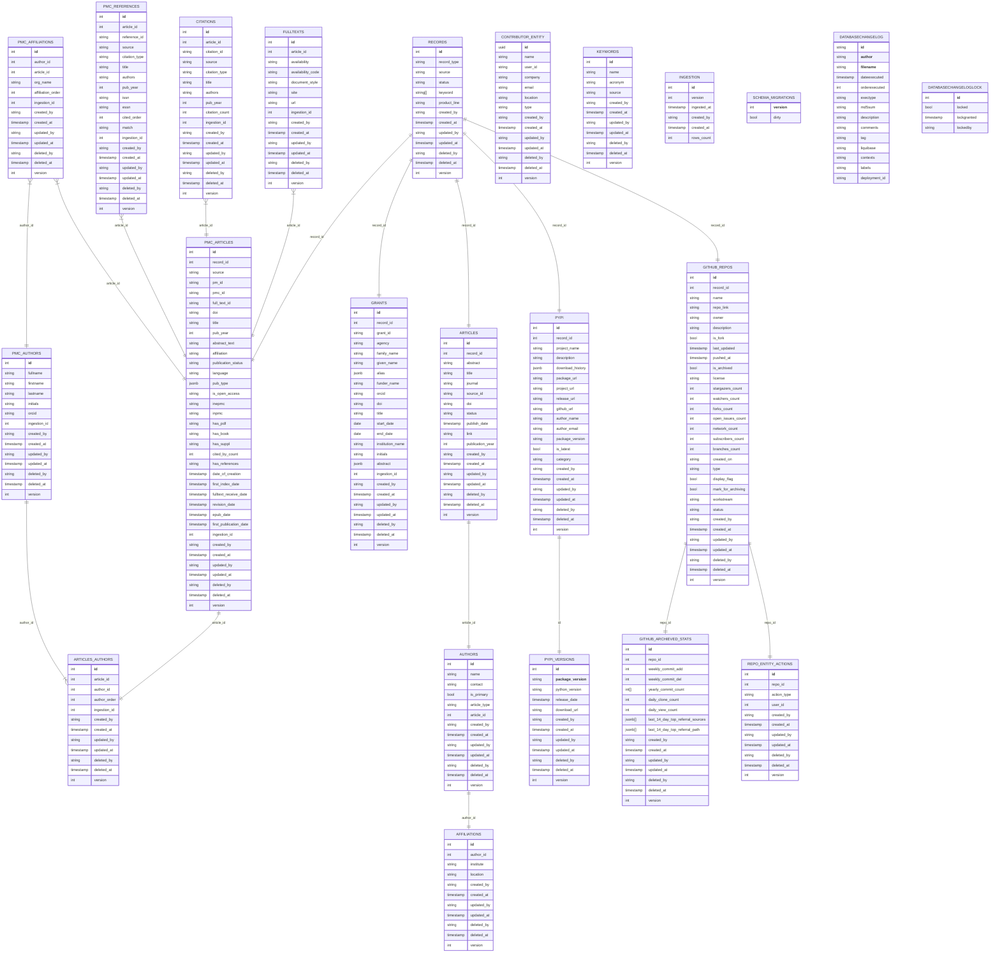

```mermaid
erDiagram

    PMC_ARTICLES ||--|| ARTICLES_AUTHORS : article_id
    PMC_AUTHORS ||--|{ ARTICLES_AUTHORS : author_id
    RECORDS ||--|| PMC_ARTICLES : record_id
    RECORDS ||--|| GRANTS : record_id
    FULLTEXTS |{--|| PMC_ARTICLES : article_id
    CITATIONS |{--|| PMC_ARTICLES : article_id
    PMC_REFERENCES |{--|| PMC_ARTICLES : article_id
    PMC_AFFILIATIONS |{--|| PMC_AUTHORS : author_id
    PMC_AFFILIATIONS |{--|| PMC_ARTICLES : article_id
    RECORDS ||--|| ARTICLES : record_id
    RECORDS ||--|| PYPI : record_id
    RECORDS ||--|| GITHUB_REPOS : record_id
    ARTICLES ||--|| AUTHORS : article_id
    AUTHORS ||--|| AFFILIATIONS : author_id
    PYPI ||--|| PYPI_VERSIONS : id
    GITHUB_REPOS ||--|| GITHUB_ARCHIEVED_STATS : repo_id
    GITHUB_REPOS ||--|| REPO_ENTITY_ACTIONS : repo_id

    RECORDS {
        int **id**
        string record_type
        string source
        string status
        string[] keyword
        string product_line
        string created_by
        timestamp created_at
        string updated_by
        timestamp updated_at
        string deleted_by
        timestamp deleted_at
        int version
    }

    ARTICLES {
        int **id**
        int record_id
        string abstract
        string title
        string journal
        string source_id
        string doi
        string status
        timestamp publish_date
        string link
        int publication_year
        string created_by
        timestamp created_at
        string updated_by
        timestamp updated_at
        string deleted_by
        timestamp deleted_at
        int version
    }

    AUTHORS {
        int **id**
        string name
        string contact
        bool is_primary
        string article_type
        int article_id
        string created_by
        timestamp created_at
        string updated_by
        timestamp updated_at
        string deleted_by
        timestamp deleted_at
        int version
    }

    AFFILIATIONS {
        int **id**
        int author_id
        string institute
        string location
        string created_by
        timestamp created_at
        string updated_by
        timestamp updated_at
        string deleted_by
        timestamp deleted_at
        int version
    }

    PMC_ARTICLES {
        int **id**
        int record_id
        string source
        string pm_id
        string pmc_id
        string full_text_id
        string doi
        string title
        int pub_year
        string abstract_text
        string affiliation
        string publication_status
        string language
        jsonb pub_type
        string is_open_access
        string inepmc
        string inpmc
        string has_pdf
        string has_book
        string has_suppl
        int cited_by_count
        string has_references
        timestamp date_of_creation
        timestamp first_index_date
        timestamp fulltext_receive_date
        timestamp revision_date
        timestamp epub_date
        timestamp first_publication_date
        int ingestion_id
        string created_by
        timestamp created_at
        string updated_by
        timestamp updated_at
        string deleted_by
        timestamp deleted_at
        int version
    }

    PMC_AUTHORS {
        int **id**
        string fullname
        string firstname
        string lastname
        string initials
        string orcid
        int ingestion_id
        string created_by
        timestamp created_at
        string updated_by
        timestamp updated_at
        string deleted_by
        timestamp deleted_at
        int version
    }

    PMC_AFFILIATIONS {
        int **id**
        int author_id
        int article_id
        string org_name
        int affiliation_order
        int ingestion_id
        string created_by
        timestamp created_at
        string updated_by
        timestamp updated_at
        string deleted_by
        timestamp deleted_at
        int version
    }

    ARTICLES_AUTHORS {
        int **id**
        int article_id
        int author_id
        int author_order
        int ingestion_id
        string created_by
        timestamp created_at
        string updated_by
        timestamp updated_at
        string deleted_by
        timestamp deleted_at
        int version
    }

    CITATIONS {
        int **id**
        int article_id
        string citation_id
        string source
        string citation_type
        string title
        string authors
        int pub_year
        int citation_count
        int ingestion_id
        string created_by
        timestamp created_at
        string updated_by
        timestamp updated_at
        string deleted_by
        timestamp deleted_at
        int version
    }

    PMC_REFERENCES {
        int **id**
        int article_id
        string reference_id
        string source
        string citation_type
        string title
        string authors
        int pub_year
        string issn
        string essn
        int cited_order
        string match
        int ingestion_id
        string created_by
        timestamp created_at
        string updated_by
        timestamp updated_at
        string deleted_by
        timestamp deleted_at
        int version
    }

    FULLTEXTS {
        int **id**
        int article_id
        string availability
        string availability_code
        string document_style
        string site
        string url
        int ingestion_id
        string created_by
        timestamp created_at
        string updated_by
        timestamp updated_at
        string deleted_by
        timestamp deleted_at
        int version
    }

    GRANTS {
        int **id**
        int record_id
        string grant_id
        string agency
        string family_name
        string given_name
        jsonb alias
        string funder_name
        string orcid
        string doi
        string title
        date start_date
        date end_date
        string institution_name
        string initials
        jsonb abstract
        int ingestion_id
        string created_by
        timestamp created_at
        string updated_by
        timestamp updated_at
        string deleted_by
        timestamp deleted_at
        int version
    }

    PYPI {
        int **id**
        int record_id
        string project_name
        string description
        jsonb download_history
        string package_url
        string project_url
        string release_url
        string github_url
        string author_name
        string author_email
        string package_version
        bool is_latest
        string category
        string created_by
        timestamp created_at
        string updated_by
        timestamp updated_at
        string deleted_by
        timestamp deleted_at
        int version
    }

    PYPI_VERSIONS {
        int **id**
        string **package_version**
        string python_version
        timestamp release_date
        string download_url
        string created_by
        timestamp created_at
        string updated_by
        timestamp updated_at
        string deleted_by
        timestamp deleted_at
        int version
    }

    GITHUB_REPOS {
        int **id**
        int record_id
        string name
        string repo_link
        string owner
        string description
        bool is_fork
        timestamp last_updated
        timestamp pushed_at
        bool is_archived
        string license
        int stargazers_count
        int watchers_count
        int forks_count
        int open_issues_count
        int network_count
        int subscribers_count
        int branches_count
        string created_on
        string type
        bool display_flag
        bool mark_for_archiving
        string workstream
        string status
        string created_by
        timestamp created_at
        string updated_by
        timestamp updated_at
        string deleted_by
        timestamp deleted_at
        int version
    }

    GITHUB_ARCHIEVED_STATS {
        int **id**
        int repo_id
        int weekly_commit_add
        int weekly_commit_del
        int[] yearly_commit_count
        int daily_clone_count
        int daily_view_count
        jsonb[] last_14_day_top_referral_sources
        jsonb[] last_14_day_top_referral_path
        string created_by
        timestamp created_at
        string updated_by
        timestamp updated_at
        string deleted_by
        timestamp deleted_at
        int version
    }

    REPO_ENTITY_ACTIONS {
        int **id**
        int repo_id
        string action_type
        int user_id
        string created_by
        timestamp created_at
        string updated_by
        timestamp updated_at
        string deleted_by
        timestamp deleted_at
        int version
    }

    CONTRIBUTOR_ENTITY {
        uuid **id**
        string name
        string user_id
        string company
        string email
        string location
        string type
        string created_by
        timestamp created_at
        string updated_by
        timestamp updated_at
        string deleted_by
        timestamp deleted_at
        int version
    }

    KEYWORDS {
        int **id**
        string name
        string acronym
        string source
        string created_by
        timestamp created_at
        string updated_by
        timestamp updated_at
        string deleted_by
        timestamp deleted_at
        int version
    }

    INGESTION {
        int **id**
        int version
        timestamp ingested_at
        string created_by
        timestamp created_at
        int rows_count
    }

    SCHEMA_MIGRATIONS {
        int **version**
        bool dirty
    }

    DATABASECHANGELOG {
        string **id**
        string **author**
        string **filename**
        timestamp dateexecuted
        int orderexecuted
        string exectype
        string md5sum
        string description
        string comments
        string tag
        string liquibase
        string contexts
        string labels
        string deployment_id
    }

    DATABASECHANGELOGLOCK {
        int **id**
        bool locked
        timestamp lockgranted
        string lockedby
    }
```
